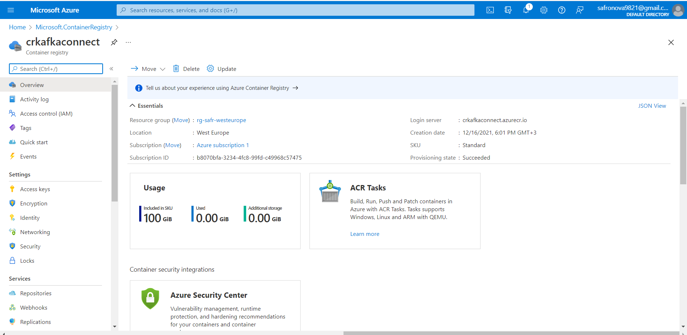
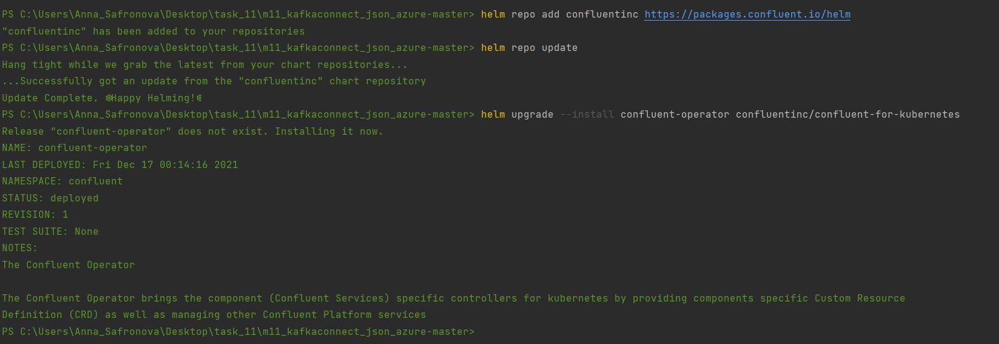
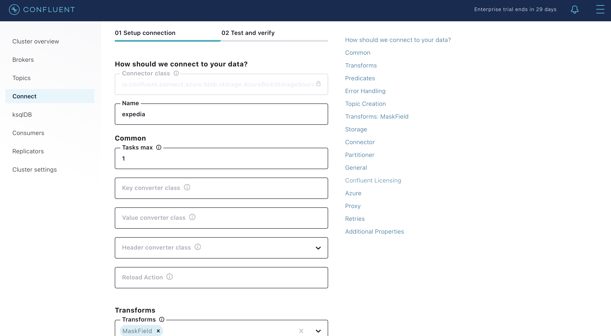

1. Data is in Azure ADLS gen2 storage bd201stacc/m11kafkaconnect.
   
  
2. Deploy Azure Kubernetes Service and Azure Storage Account, to setup infrastructure use terraform scripts.
   ```
   terraform init
   terraform plan -out terraform.plan
   terraform apply terraform.plan
   terraform destroy
  


3. Configure kubectl to connect to the AKS cluster:
```
az aks update -n <cluster name> -g <resource group name> --attach-acr <registry name>
```



4. Build and push Docker image to ACR:
```
   az acr login -n <registry name>
   docker build -f  connectors/Dockerfile -t crkafkaconnect.azurecr.io/imgkafkaconnect:safr .
   docker push crkafkaconnect.azurecr.io/imgkafkaconnect:safr
```

 
5. Launch Confluent for Kubernetes
- Create the namespace to use:
  ```
  kubectl create namespace confluent11
  ```
- Set this namespace to default for your Kubernetes context:
  ```
  kubectl config set-context --current --namespace confluent11
  ```
- Add the Confluent for Kubernetes Helm repository:
  ```
  helm repo add confluentinc https://packages.confluent.io/helm
  helm repo update
  ```
- Install Confluent for Kubernetes:
  ```
  helm upgrade --install confluent-operator confluentinc/confluent-for-kubernetes
  ```
  
6. Install Confluent Platform
- Install all Confluent Platform components:
  ```
  kubectl apply -f ./confluent-platform.yaml
  ```
- Install a sample producer app and topic:
  ```
  kubectl apply -f ./producer-app-data.yaml
  ```
- Check that everything is deployed:
  ```
  kubectl get pods -o wide 
  ```
  
- Set up port forwarding to Control Center web UI from local machine:
  ```
  kubectl port-forward controlcenter-0 9021:9021
  ```
 - Browse to Control Center: [http://localhost:9021](http://localhost:9021)


7. Create a kafka topic
- The topic should have at least 3 partitions because the azure blob storage has 3 partitions. Name the new topic: "expedia".

8. Prepare the azure connector configuration

9. Upload the connector file through the API (Upload connector config file)



10. Result in topic (check messages)


